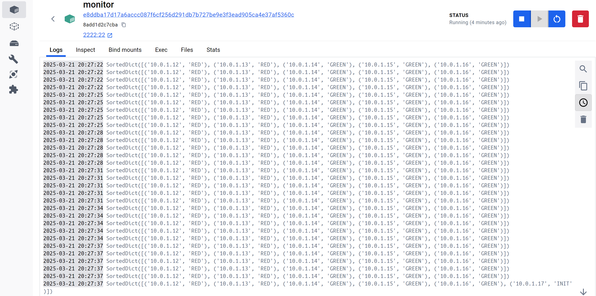

# DSA1 LS 2025

# Úvod
Distirbuovaný systém "obarvování" uzlů. Cílem je nastavit 1/3 uzlů na "RED" a zbytek na "Green".

Řešeno pomocí tzv. "bully algorithm" pro volbu leadera (leader je ten, co má v daný okamžik nějvětší IP). Leader pak uzlům přiděluje "barvu".

Systém obsahuje dva typy uzlů `BaseNode`, a pak `MonitorNode`, který slouží pouze ke sledování stavu systému.

# Složky

- src
  - nodes - všechny implementační soubory spojeny s fungováním uzlů
  - utils - ostatní funcke, třídy a typy, které jsou používány napříč aplikací  

# Soubory

- config.py - konfigurační soubor, obsahuje konstanty
- main.py - vstupní soubor aplikace, vytváří buď BaseNode nebo MonitorNode (v závisloti na environment proměnné)
- nodes
  - BaseNode - implementuje základní funkcionalitu uzlu, společnou ať už pro slave nebo leader uzel
  - LeaderMode - funkcionalita Leader uzlu
  - SlaveMode - funkcionalita Slave uzlu
  - MonitorNode - monitorovací uzel
- utils
  - ip_tools - funkce pro práci s IP adresou
  - protocol_msgs - všechny funcke a typy spojené se zpracováváním a odesíláním zpráv protokolu
  - sorted_structs - struktury implicitně seřazené pomocí heapq
  - UDPServer - server pro příjem UDP zpráv, běží na portu definovaném v config.py

BaseNode se může "přepínat" mezi LeaderMode a SlaveMode na základě aktuálního stavu systému.  

# Spuštení

Lze spustit pomocí příkazu:
```
vagrant up
```
Nic dalšího není třeba 

# Algoritmus volby leadera
- Implementováno v `BaseNode.py`

1) Uzel začíná ve stavu `INIT`
2) Pokud při periodickém spuštění timer_task() zjistí, že nemá leadera, odešele leader request a přejde do stavu `SENT_LEADER_REQUEST`
3) Pokud obdrží odpověď od leadera, konec, jinak odešle ELECTION BROADCAST zprávu a přejde do stavu `SENT_ELECTION_BROADCAST`
4) Pokud žádný uzel (**s vyšší IP**) neodpoví do času `config.KEEPALIVE_INTERVAL`, stává se uzel leaderem, informuje ostatní uzly pomocí `send_victory_broadcast() `

- Pokud uzel obdrží election zprávu od uzlu s větší IP, přejde do stavu `ELECTION_MSG_RECEIVED`, pak `ELECTION_MSG_LONG_DELAY`, pokud stále neobdržel `VICTORY` zprávu, začíná proces volby od znova

# Keepalive
- Slave uzly odesálají KEEPALIVE leader uzlu, pokud leader neobdrží KEEPALIVE do času config.NODE_DEAD_AFTER je uzel považován za mrtvého
- Pokud Slave neobdrží od Leader uzlu odpověď od času config.LEADER_DEAD_AFTER, je leader považován za mrtvého

# Ověření funkčnosti
- Barvy uzlů lze sledovat v STDOUT monitor uzlu

Ustálí se na:
```
SortedDict([('10.0.1.10', 'RED'), ('10.0.1.11', 'RED'), ('10.0.1.12', 'RED'), ('10.0.1.13', 'RED'), ('10.0.1.14', 'GREEN'), ('10.0.1.15', 'GREEN'), ('10.0.1.16', 'GREEN'), ('10.0.1.17', 'GREEN'), ('10.0.1.18', 'GREEN'), ('10.0.1.19', 'GREEN')])
```
To je správně, protože:
- celkem uzlů = 10
- red uzlů = math.ceil(10 * (1/3)) = 4
- green uzlů = 10 - 4 = 6
# Ostatní 
## Naming convention
- Soubory:
  - snake_case - obsahuje funkce a definice pomocných typů
  - CamelCase - obsahuje definici třídy
- Program:
  - CamelCase - názvy tříd
  - snake_case - lokální symboly, členské funkce, globální symboly
  - SNAKE_CASE - konstanty, enum položky

# Závěr

Systém byl otestován jako funkční, poskytuje "obarvení uzlů" a mechanizmy zotavení po výpadku buď Slave nebo Leader uzlu.